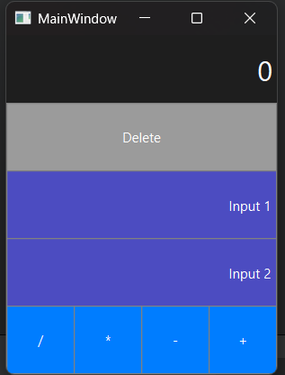

# 🧮 Calculator

A clean, modern calculator built with C++ and Qt.  

This project contains **two different calculator implementations** developed in C++:

1. **Console-based calculator**: Built and tested in **Visual Studio Code**. It runs in the terminal and allows users to perform basic operations via text input.
2. **Graphical calculator (GUI)**: Developed using **Qt and Qt Creator**, featuring a user-friendly graphical interface with buttons, input fields, result display, and optional features like history and export.

Both calculators share the same core logic, but offer different user experiences:  
- The **VS Code version** is ideal for quick terminal-based calculations.  
- The **Qt version** showcases modern GUI design and interaction using the Qt Widgets framework.

---

## 📸 Preview

 

---

## 🚀 Features

- ✅ Basic arithmetic operations: `+`, `-`, `*`, `/`
- ✅ Clean Qt GUI using Widgets
- ✅ Input fields for numbers
- ✅ Clear/Delete button to reset inputs
- ✅ Real-time result display
- ✅ Error handling for divide-by-zero
- ✅ History of operations
- ✅ Export history to `.txt` file

---

## 🧠 Technologies Used

- **C++**
- **Qt 6** (Widgets module)
- Qt Creator (for design and UI layout)

---

## 🛠 How to Build Locally

### 🔧 Requirements:
- [Qt Creator](https://www.qt.io/download)
- Qt SDK with Widgets Module (5.15+ or 6.x)

---

## 📁 Project Structure (Qt)

```text
Calculator/
├── main.cpp              # Entry point of the application
├── mainwindow.ui         # Qt Designer layout file (GUI)
├── mainwindow.h          # Header for the MainWindow class
├── mainwindow.cpp        # Logic for the calculator (slots, operations)
├── calculator.h          # (Optional) Separate calculator logic class
├── calculator.cpp        # (Optional) Calculator class implementation
├── CMakeLists.txt        # Build instructions for CMake users
├── README.md             # Project documentation
├── screenshot.png        # GUI preview image for GitHub
